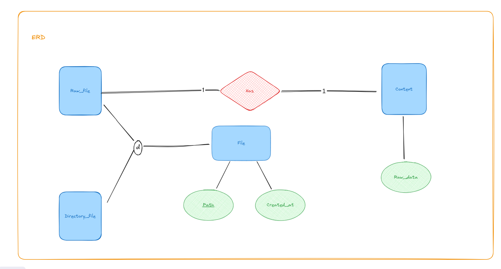

# Virtual file system

## Application architecture


### Code structure

```py
## Front-End

📦src
 ┣ 📂components     # UI building blocks
 ┣ 📂handlers       # Command interaction and validation (hooks)
 ┣ 📂services       # Back-end API communication
 ┣ 📂state          # Shared state using Zustand
 ┣ 📂types          # Types
 ┣ 📂utils          # General-purpose utility functions
 ┣ 📜App.tsx        # Main application component
 ┗ 📜main.tsx       # Front-end entry point
 ```

```py
## Back-End

📦src
 ┣ 📂configs        # Environment variables and settings
 ┣ 📂constants      # Back-end fixed values
 ┣ 📂dtos           # Data structures for requests/responses (in/out, common)
 ┣ 📂handlers       # Core business logic for APIs/tasks
 ┣ 📂interfaces     # Contracts for entities or services
 ┣ 📂repositories   # Data source interaction
 ┣ 📂routes         # API endpoint definitions
 ┣ 📂types          # Types
 ┣ 📂utils          # General-purpose utility functions
 ┣ 📜Server.ts      # Server configuration and startup
 ┗ 📜index.ts       # Back-end entry point
 ```

### Architecture strength

- **Clear separation of concerns:** Each component has a well-defined responsibility, making the code more modular and maintainable.
- **Scalability:** Adding new functionalities (commands) is relatively straightforward as you can create new components without affecting existing ones.

### Architecture Weaknesses

- **Potential for code duplication:** Defining each command separately can lead to repetitive logic if commands share similar functionalities.

## Database design

Two approaches were considered for data design: recursive and flattened.

### Recursive Approach


- Strengths:
  - Clearly represents the hierarchical nature of directories and files.
- Weaknesses:
  - Requires multiple queries to retrieve files within nested directories (e.g., 5 queries for a/b/c/d/e).
  - Inefficient for large directory structures with many nested levels.
  - Might not scale well for performance in the future.

### Flattened Approach



- Strengths:
  - Fewer queries needed (single query for any file path).
  - Enables efficient retrieval of items within a folder using indexing.
- Weaknesses:
  - Loses the explicit representation of the directory hierarchy.
  - Might require additional logic to reconstruct the hierarchy.

### Mapping

I chose the `flattened approach` because application requirements prioritize handling a large user base and amounts of items while maintaining a positive user experience.


## Functionality

### Supported Commands

- `cd FOLDER_PATH`: Changes the current working directory to the specified path.

- `cr [-p] PATH [DATA]`: Creates a new file (if `DATA` is provided) or folder at the specified path.
  - `-p` (optional): Creates missing parent folders.
- `cat FILE_PATH`: Displays the content of a file. Raises an error for non-existent files.
- `ls [FOLDER_PATH]`: Lists all items (name, created_at, size) directly under the current working directory or optional specified folder.
- `find NAME [FOLDER_PATH]`: Searches for files/folders containing the substring NAME within the current working directory or optional specified folder, including subfolders.
- `up PATH NAME [DATA]`: Updates the file/folder at `PATH` with a new `NAME` and optional `DATA`.
- `mv PATH FOLDER_PATH`: Moves a file/folder at `PATH` to the destination `FOLDER_PATH`.
- `rm PATH [PATH2 PATH3...]`: Removes files/folders at the specified paths.

### Aliases

- `.`: Current working directory
- `..`: Parent directory
- `/`: Root directory

## Concurrency management

- Leverages database transactions for data consistency.
- Conflicts happend:
  - One user remove file, one user move file
  - One user read file, one user remove/move file
  - One user read file, one user update file
- Resolved using a first-come, first-served approach.
- Future Scaling: Cassandra with "Read all, write one" consistency is ideal for future horizontal scaling due to high read availability for frequent user reads. However, write availability may be lower, a trade-off acceptable for read-heavy workloads.
