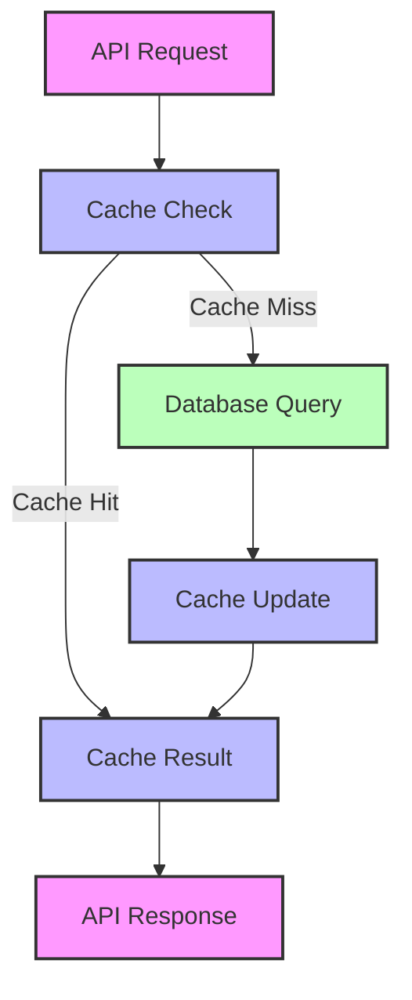
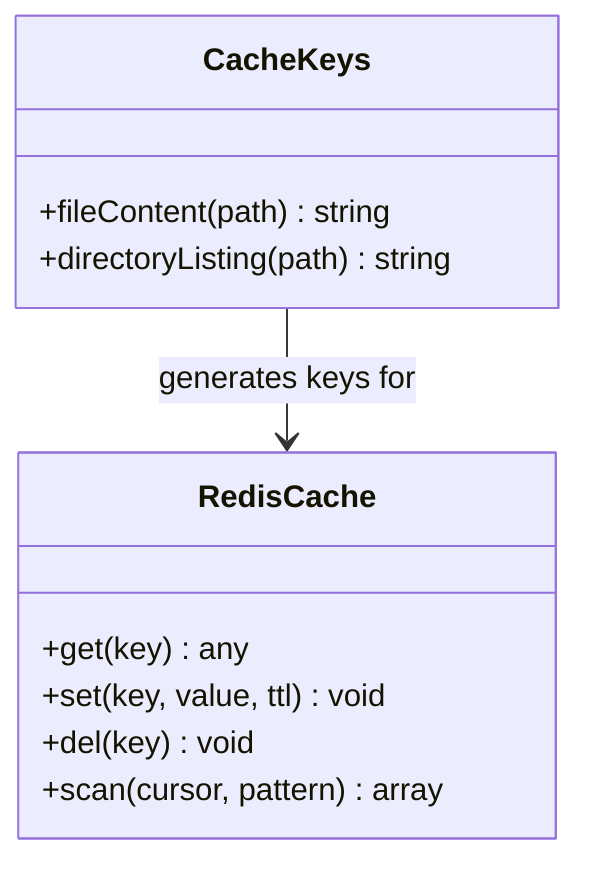
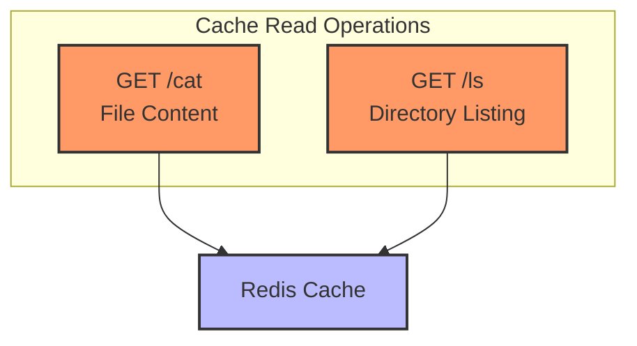
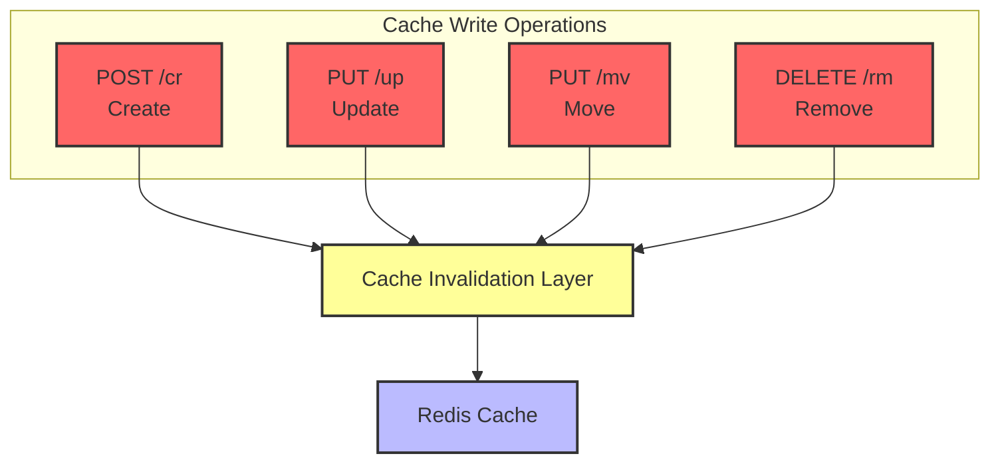
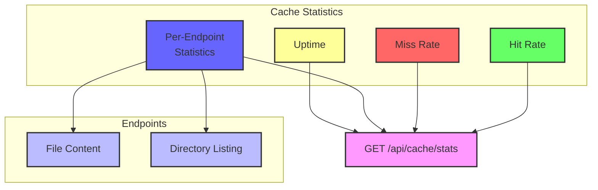

# Redis Caching Architecture in Virtual File System API

This document provides an overview of the Redis caching implementation in the Virtual File System API, detailing which features set/get cache and which features invalidate cache.

## Table of Contents

1. [Architecture Overview](#architecture-overview)
2. [Cache Key Structure](#cache-key-structure)
3. [Cache Operations by Feature](#cache-operations-by-feature)
4. [Cache Invalidation Flow](#cache-invalidation-flow)
5. [Monitoring and Statistics](#monitoring-and-statistics)

## Architecture Overview

The caching system uses Redis as an in-memory data store to cache frequently accessed data, reducing database load and improving response times. The implementation follows these principles:

- **Read-through caching**: API endpoints check the cache first before querying the database
- **Write-through invalidation**: Write operations invalidate affected cache entries
- **TTL-based expiration**: All cache entries have a time-to-live to prevent stale data
- **Hierarchical invalidation**: Operations on a path invalidate parent paths when necessary

## Cache Key Structure

The caching system uses structured key patterns to organize different types of cached data:

| Cache Type        | Key Pattern           | Example                         |
| ----------------- | --------------------- | ------------------------------- |
| File Content      | `file:content:{path}` | `file:content:/docs/report.txt` |
| Directory Listing | `dir:listing:{path}`  | `dir:listing:/docs`             |

## Cache Operations by Feature

### Features That Get/Set Cache

| API Endpoint | Handler            | Cache Operation | Cache Type        | TTL            |
| ------------ | ------------------ | --------------- | ----------------- | -------------- |
| GET /api/cat | showFileContent    | Get & Set       | File Content      | 3600s (1 hour) |
| GET /api/ls  | listDirectoryItems | Get & Set       | Directory Listing | 1800s (30 min) |

### Features That Invalidate Cache

| API Endpoint   | Handler             | Cache Invalidation              | Affected Cache Types            |
| -------------- | ------------------- | ------------------------------- | ------------------------------- |
| POST /api/cr   | createFileDirectory | Parent directory                | Directory Listing               |
| PUT /api/up    | updateFileDirectory | File content, Directory listing | File Content, Directory Listing |
| PUT /api/mv    | moveFileDirectory   | Source & destination paths      | File Content, Directory Listing |
| DELETE /api/rm | removeFileDirectory | File content, Parent directory  | File Content, Directory Listing |

## Cache Invalidation Flow

The cache invalidation flow ensures data consistency by removing affected cache entries when data changes:

### Detailed Invalidation Logic

1. **File Creation (POST /api/cr)**:
   - Invalidates parent directory listing cache
   - Example: Creating `/docs/new.txt` invalidates `dir:listing:/docs`

2. **File/Directory Update (PUT /api/up)**:
   - Invalidates file content cache for the updated file
   - Invalidates directory listing cache for the parent directory
   - Example: Updating `/docs/report.txt` invalidates `file:content:/docs/report.txt` and `dir:listing:/docs`

3. **File/Directory Move (PUT /api/mv)**:
   - Invalidates file content cache for the moved file
   - Invalidates directory listing cache for both source and destination parent directories
   - Example: Moving `/docs/report.txt` to `/archive/report.txt` invalidates `file:content:/docs/report.txt`, `file:content:/archive/report.txt`, `dir:listing:/docs`, and `dir:listing:/archive`

4. **File/Directory Removal (DELETE /api/rm)**:
   - Invalidates file content cache for the removed file
   - Invalidates directory listing cache for the parent directory
   - Example: Removing `/docs/report.txt` invalidates `file:content:/docs/report.txt` and `dir:listing:/docs`

## Monitoring and Statistics

The caching system includes monitoring capabilities to track performance:

- **Cache Hit/Miss Rates**: Tracks overall and per-endpoint cache effectiveness
- **API Endpoints**: GET /api/cache/stats and POST /api/cache/reset for monitoring and management
- **Logging**: Detailed logs for cache operations and invalidations

This caching architecture provides significant performance improvements for read-heavy operations while maintaining data consistency through proper cache invalidation for write operations.
