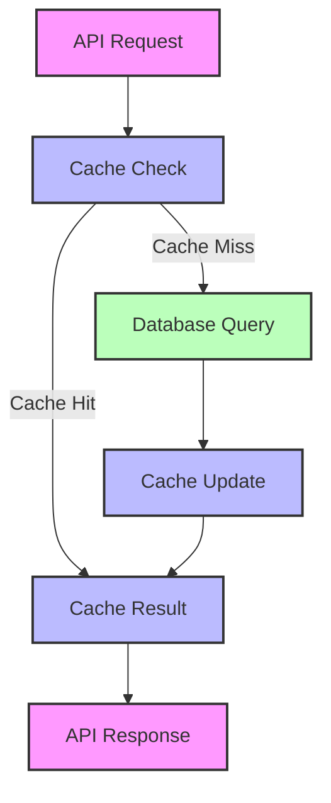
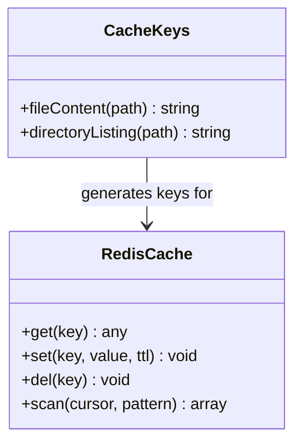
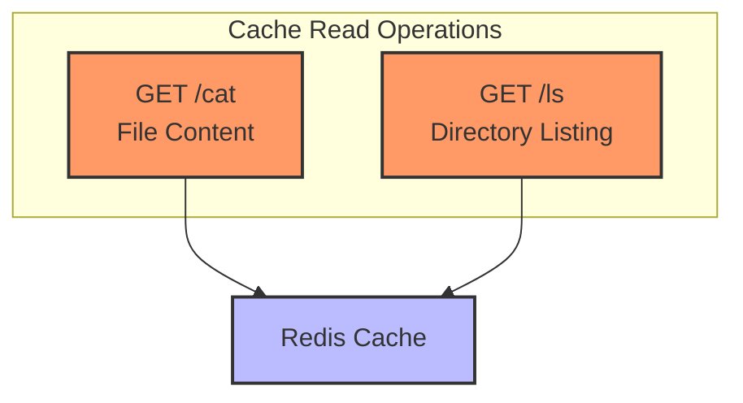
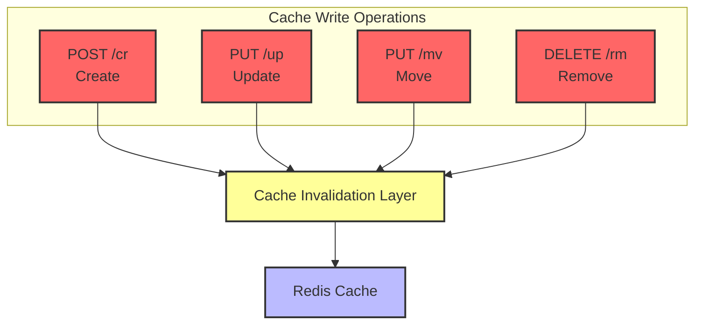
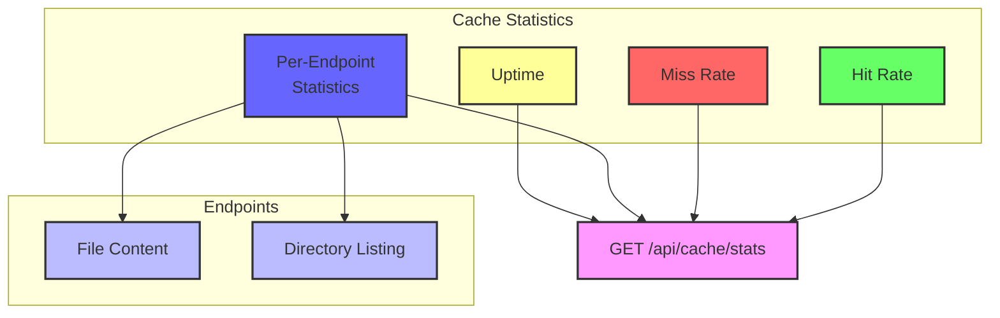

# Kiến Trúc Redis Cache trong API Hệ Thống Tệp Ảo

Tài liệu này cung cấp tổng quan về việc triển khai Redis cache trong API Hệ Thống Tệp Ảo, mô tả chi tiết các tính năng nào set/get cache và các tính năng nào invalidate cache.

## Mục Lục

1. [Tổng Quan Architecture](#tổng-quan-architecture)
2. [Cấu Trúc Cache Keys](#cấu-trúc-cache-keys)
3. [Cache Operations Theo Feature](#cache-operations-theo-feature)
4. [Cache Invalidation Flow](#cache-invalidation-flow)
5. [Monitoring và Statistics](#monitoring-và-statistics)

## Tổng Quan Architecture

Hệ thống sử dụng Redis làm in-memory data store để lưu trữ dữ liệu được truy cập thường xuyên, giảm tải database và cải thiện response time. Việc triển khai tuân theo các nguyên tắc sau:

- **Read-through caching**: API endpoints kiểm tra cache trước khi query database
- **Write-through invalidation**: Write operations invalidate các cache entries bị ảnh hưởng
- **TTL-based expiration**: Tất cả cache entries đều có time-to-live để ngăn stale data
- **Hierarchical invalidation**: Operations trên một path invalidate các parent paths khi cần thiết

## Cấu Trúc Cache Keys

Hệ thống sử dụng structured key patterns để tổ chức các loại cached data khác nhau:

| Cache Type        | Key Pattern           | Example                         |
| ----------------- | --------------------- | ------------------------------- |
| File Content      | `file:content:{path}` | `file:content:/docs/report.txt` |
| Directory Listing | `dir:listing:{path}`  | `dir:listing:/docs`             |

## Cache Operations Theo Feature

### Features That Get/Set Cache

| API Endpoint | Handler            | Cache Operation | Cache Type        | TTL            |
| ------------ | ------------------ | --------------- | ----------------- | -------------- |
| GET /api/cat | showFileContent    | Get & Set       | File Content      | 3600s (1 hour) |
| GET /api/ls  | listDirectoryItems | Get & Set       | Directory Listing | 1800s (30 min) |

### Features That Invalidate Cache

| API Endpoint   | Handler             | Cache Invalidation              | Affected Cache Types            |
| -------------- | ------------------- | ------------------------------- | ------------------------------- |
| POST /api/cr   | createFileDirectory | Parent directory                | Directory Listing               |
| PUT /api/up    | updateFileDirectory | File content, Directory listing | File Content, Directory Listing |
| PUT /api/mv    | moveFileDirectory   | Source & destination paths      | File Content, Directory Listing |
| DELETE /api/rm | removeFileDirectory | File content, Parent directory  | File Content, Directory Listing |

## Cache Invalidation Flow

Cache invalidation flow đảm bảo data consistency bằng cách xóa các cache entries bị ảnh hưởng khi data thay đổi:

### Detailed Invalidation Logic

1. **File Creation (POST /api/cr)**:
   - Invalidates parent directory listing cache
   - Example: Creating `/docs/new.txt` invalidates `dir:listing:/docs`

2. **File/Directory Update (PUT /api/up)**:
   - Invalidates file content cache for the updated file
   - Invalidates directory listing cache for the parent directory
   - Example: Updating `/docs/report.txt` invalidates `file:content:/docs/report.txt` and `dir:listing:/docs`

3. **File/Directory Move (PUT /api/mv)**:
   - Invalidates file content cache for the moved file
   - Invalidates directory listing cache for both source and destination parent directories
   - Example: Moving `/docs/report.txt` to `/archive/report.txt` invalidates `file:content:/docs/report.txt`, `file:content:/archive/report.txt`, `dir:listing:/docs`, and `dir:listing:/archive`

4. **File/Directory Removal (DELETE /api/rm)**:
   - Invalidates file content cache for the removed file
   - Invalidates directory listing cache for the parent directory
   - Example: Removing `/docs/report.txt` invalidates `file:content:/docs/report.txt` and `dir:listing:/docs`

## Monitoring và Statistics

Hệ thống bao gồm các monitoring capabilities để track performance:

- **Cache Hit/Miss Rates**: Tracks overall và per-endpoint cache effectiveness
- **API Endpoints**: GET /api/cache/stats và POST /api/cache/reset cho monitoring và management
- **Logging**: Detailed logs cho cache operations và invalidations

Kiến trúc cache này cung cấp cải thiện performance đáng kể cho read-heavy operations trong khi vẫn duy trì data consistency thông qua proper cache invalidation cho write operations.
